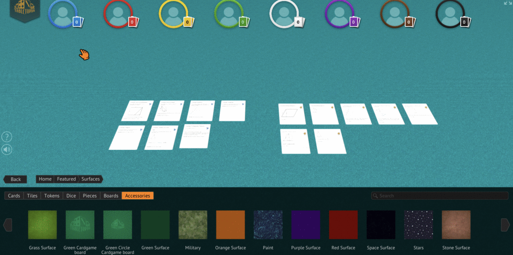

# Khan Academy PNP

This is a hackathon demo that describes how we convert a CSV of exported
data into a printable format (or virtual playtest format) for our game.

```
# Generate printable PDFs
pipenv run ./render.py

# Generate PNG for tabletopia import
pipenv run ./render.py --tabletopia
```

Note that this step is converting CSV into the output cards.  To generate the
initial CSV, you will need internal Khan Academy's server content API access.
Welcome to ping me (@dat-boris) if you have any use case.


# Output of print and play

[Link for pdf](hint_0.pdf)

# Output of tabletopia exports

